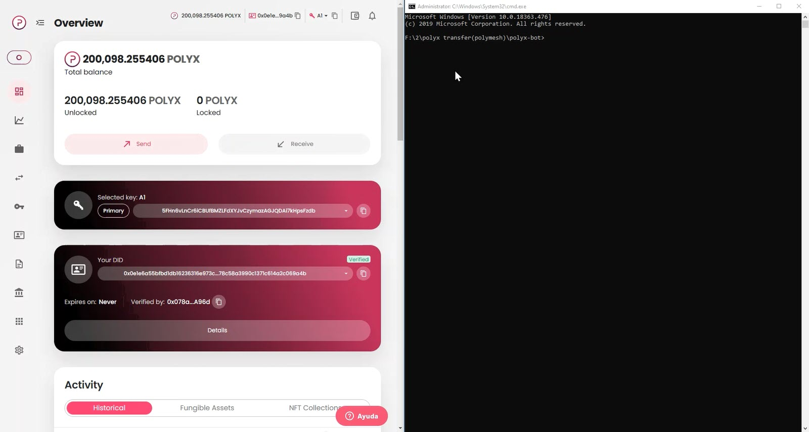

## Polymesh bot

[](Capture.mp4)

## Setup

1. Node.js

   If you don’t have Node.js installed, [install it from here](https://nodejs.org/en/).

   Use the LTS (long time support) variant. If you want to check if node has been installed successfully, go open the cmd and type ```node -v```. If everything is ok, you should see something like v20.13.1


2. Typescript

   Run the following command in the cmd.

   ```
   npm install -g typescript ts-node
   ```

   This will install Typescript globally. In the same manner, if you want to check for Typescript being installed, type ```tsc -v``` in the cmd and you should get back something like Version 5.3.3.


3. Navigate into the project directory and then install dependencies.
   ```
   yarn install
   ```


4. Run the app:

   ```bash
   npm run
   ```
